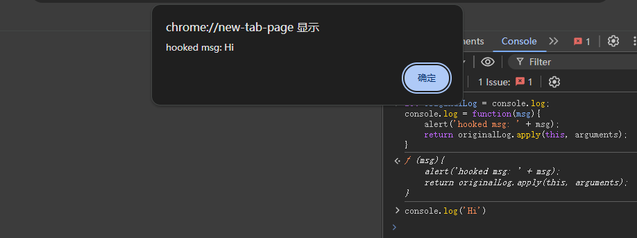
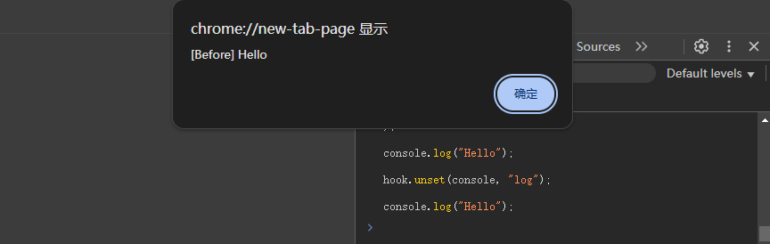
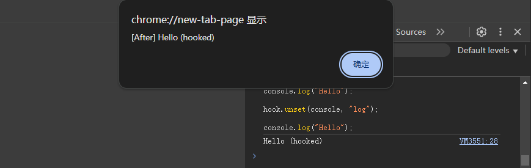
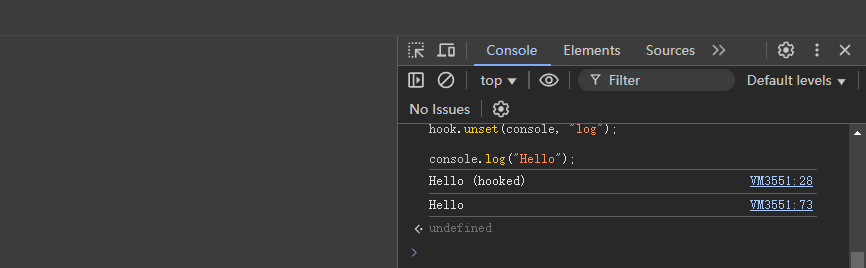

# JS Hook

## JS 函数钩子

### 简单钩子

下面是一个简单的函数钩子，演示了为 console.log 添加钩子，劫持 log 消息。

```javascript
let originalLog = console.log;
console.log = function(msg){
    alert('hooked msg: ' + msg);
    return originalLog.apply(this, arguments);
}
```

添加钩子后执行 console.log('Hi')，发现控制台输出 Hi 之前出现了 alert 弹窗，点击确定之后控制台才出现 Hi



### 钩子封装

基于简单函数钩子的原理，将其封装成类，统一管理钩子的挂载、删除、获取和重置。

```javascript
class Hook {
    constructor() {
        this.hooks = [];
    }

    get(object, funcName) {
        return this.hooks.find(hook => hook.object === object && hook.funcName === funcName);
    }

    set(object, funcName, before, after) {
        let hook = this.get(object, funcName);
        if (hook) {
            hook.before = before;
            hook.after = after;
            return;
        }

        let originalFunc = object[funcName];

        hook = { object, funcName, originalFunc, before, after };
        this.hooks.push(hook);

        object[funcName] = function () {
            let newArgs;
            if (typeof hook.before === "function") {
                newArgs = hook.before.apply(this, arguments);
            }
            let result = originalFunc.apply(this, newArgs || arguments);
            if (typeof hook.after === "function") {
                hook.after.apply(this, newArgs || arguments);
            }
            return result;
        };
    }

    unset(object, funcName) {
        let hook = this.get(object, funcName);
        if (hook) {
            object[funcName] = hook.originalFunc;
            return this.hooks.splice(this.hooks.indexOf(hook), 1)[0];
        }
        return false;
    }

    reset() {
        this.hooks.forEach(hook => {
            hook.object[hook.funcName] = hook.originalFunc;
        });
        this.hooks = [];
    }
}
```

用法：

```javascript
let hook = new Hook();

hook.set(
    console,
    "log",
    function () {
        alert(`[Before] ${arguments[0]}`);
        arguments[0] = `${arguments[0]} (hooked)`;
        return arguments;
    },
    function (msg) {
        alert(`[After] ${msg}`);
    }
);

console.log("Hello");

hook.unset(console, "log");

console.log("Hello");
```

执行过程：

alert 弹窗在控制台输出 Hello 之前出现



点击确定后控制台输出被劫持过的 Hello，之后 alert 弹窗显示劫持过的 Hello。



点击确定后钩子被取消，控制台正常输出 Hello


