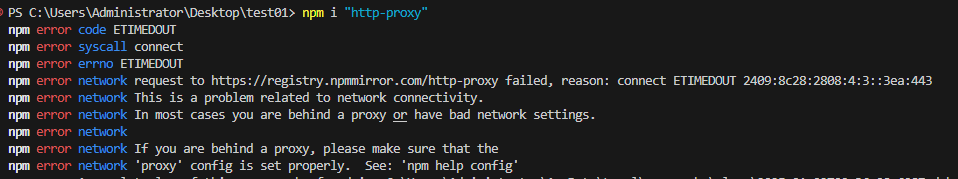
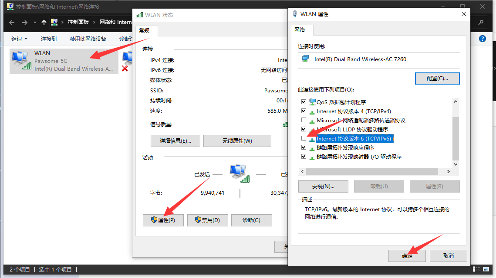

# NodeJS 常用命令总结

## npm init

## npm install

## 遇到过的问题

### npm i 报错 npm error code ETIMEDOUT

使用 npm i 安装包时长时间无响应后提示 npm error code ETIMEDOUT



以下方法都尝试过，但仍然报错

```Bash
# 设置淘宝镜像
npm config set registry https://registry.npmmirror.com/

# 清除代理
npm config delete proxy
npm config delete http-proxy
npm config delete https-proxy
```

解决方法：在控制面板->网络和 Internet->网络连接中，双击正在使用的网卡，之后在属性中取消 IPv6


