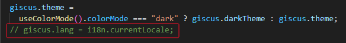

# giscus 报错 Refused to frame

## 问题描述

参考文章 [如何为Docusaurus添加Giscus评论系统 | Docusaurus | thewang](https://thewang.net/en/blog/how-to-add-giscus-comment-system-to-docusaurus/).

按照以上文章中的步骤：

1. 

配置好 giscus 后重启项目，本来应该成功，但页面中显示 giscus.app 拒绝连接。

浏览器控制台出现报错:
Refused to frame 'https://giscus.app/' because an ancestor violates the following Content Security Policy directive: "frame-ancestors 'self'".

## 报错原因

查阅资料得知，报错原因是 giscus 配置项中的 lang 属性值错误，可以是 `zh-CN` 、 `en` ，不能是 `zh-cn 。`

## 解决方法

在 docusaurus 项目中的 src/components/Comments/index.tsx 文件中，将对 lang 属性赋值语句注释掉，或者直接改成

`giscus.lang = '`zh-CN `';`

将 docusaurus.config.js 文件中的 lang 配置为 zh-CN

重启项目，发现问题已解决。
