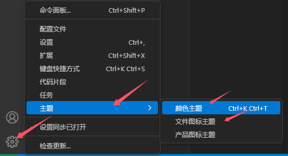

# MarkDown 编辑器

## 桌面端

桌面端 MarkDown 编辑器推荐使用 [Typora](https://typora.io/)，[typora破解补丁(解压到安装目录).zip](typora破解补丁(解压到安装目录).zip)

## VSCode 插件

VSCode 插件同样推荐使用 Typora

此插件安装后，VSCode 的主题和文件图标会被修改，可以在 VSCode 的设置中改回来。

---
