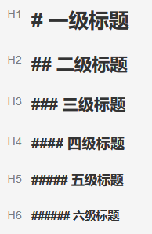

# MarkDown 语法总结

### 1.修改样式

#### 1.1、导入主题文件

##### github-dark.css

在文件->偏好设置->外观->打开主题文件夹，将github-dark.css 放入该文件夹，之后重启 typora 选择该主题。

#### 1.2、导入修改好的样式（可跳过）

##### setting-dist文件夹

用 setting-dist 文件夹替换 Typora安装路径\resources\app\setting-dist

##### base-control.css

用base-control.css替换 Typora安装路径\resources\app\style\base-control.css

#### 1.3、自定义样式（可跳过）

在视图->开发者工具(shift+F12) 调试好css样式后，在调试窗口打开修改好的css文件，右键save as，保存并覆盖 Typora\resources\app\style\themes（有的可能在其他文件夹，例如Typora\resources\app\style\base-control.css）。

### 2.大纲折叠

点击 文件-->偏好设置-->外观-->侧边栏

### 3. 修改快捷键

进入 文件->偏好设置->通用->打开高级设置，修改conf.user.json即可。

> C:\Users\用户名\AppData\Roaming\Typora\conf\conf.user.json

> 参考 快捷键函数表.PDF

**注意：只能修改或添加 conf.user.json，不能修改 conf.default.json**

## 文本样式

### 标题 (#+空格)



### 下划线

\<u>`<u>`下划线 `</u>`\</u>

### 斜体

\*_斜体_\*

### 强调

\*\***强调**\*\*

### 引用

\>空格

> 引用内容
>
>> 二级引用
>>

### 已删除

\~\~~~已删除~~\~\~

### 框起来

\``框起来`\`

### 脚注

脚注[^2]

### 高亮

\=\=高亮文本\=\=，效果：==高亮文本==

> 注意：高亮、图表、内联公式、上下角标需要在偏好设置中的 Markdown 拓展语法中打开并重启 Typora。如果编辑器不支持高亮，也可以使用 html 标签： \<mark><mark>高亮文本</mark>\<mark>

### 上下角标

\^1^ 上角标^1^

\~1~ 下角标~1~

### 转义

\\反斜杠

### 分割线

---或\*\*\*

---

---

## 列表样式

### 有序列表：

数字.空格...

1. ...
2. ...
3. ...

### 无序列表：

三种方式：+空格、-空格、\*空格 ，Tap 键缩进 ，shift + Tap 取消缩进

- 。。。。。
- 。。。。。
  - 。。。。。
  - 。。。。。
- 。。。。

### 待办列表 :

-空格[空格]空格

- [X] 待办一
- [ ] 待办二

## 插入元素

### 插入图片：

直接拖入，即 \!\[tip](url) ：


使用 html 中 img 标签的方式(有些编辑器不支持)：\


### 插入表格：

|空格|空格|空格|回车

> 建议右键插入，然后修改源码

| 。。。。 | 。。。 | 。。。 |
| :------: | :----- | -----: |
|   。。   | 。。   |   。。 |

### 插入链接：

[百度](https://www.baidu.com) \[百度](https://www.baidu.com)

### 插入公式：

\$公式\$
$(x^2+y^2)/2=z^2$

\$\$居中的公式\$\$

$$
(x^2+y^2)/2=z^2
$$

### 插入代码：

\~\~\~回车

C:

```c
int main(void)
{
    printf("Hello word!");
    return 0;
}
```

JS:

```javascript
(function ($) {
  // Search
  var $searchWrap = $('#search-form-wrap'),
    isSearchAnim = false,
    searchAnimDuration = 200;

  var startSearchAnim = function () {
    isSearchAnim = true;
  };

  var stopMobileNavAnim = function () {
    setTimeout(function () {
      isMobileNavAnim = false;
    }, mobileNavAnimDuration);
  }

  $('#wrap').on('click', function () {
    if (isMobileNavAnim || !$container.hasClass('mobile-nav-on')) return;

    $container.removeClass('mobile-nav-on');
  });
})(jQuery);
```

### 插入表情：

:关键词: ([支持的关键词](https://gist.github.com/rxaviers/7360908))

:smile\: 😄，:sunny\: ☀️，:rose\: 🌹

[^2]: 这是一个脚注解释
