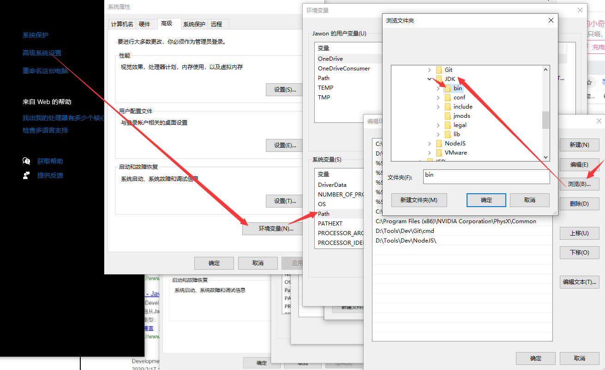

# 记录一次安卓逆向过程

## 教程链接

[B站：【PC下安卓逆向拆包编译打包与重新签名】](https://www.bilibili.com/video/BV1kK4y1x74s/?share_source=copy_web&vd_source=c943435ffb8e7c3f96d68b17a92d7356)

## 实验环境

### 操作系统

window10 专业版

### 工具

[Apktool | Apktool](https://apktool.org/)

[Java Downloads | Oracle](https://www.oracle.com/java/technologies/downloads/)

## 步骤

### 初步尝试

1. 安装完 JDK 之后，记住安装位置，之后打开 window 设置 -> 关于 -> ：（如下图，在 Path 中添加环境变量）

   
2. 下载 apktool.jar
3. 将 apktool.jar 与目标 apk 文件放到同一文件夹
4. 打开 cmd 执行命令 java -jar apktool.jar d xxx.apk
5. 稍等片刻，xxx.apk就被反编译完成了，整个过程非常丝滑~~~

但是，打开反编译出的文件夹后，好多没见过的文件格式，不知如何查看源码。

### 第二次尝试

[Android 反编译利器，jadx 的高级技巧 - 简书](https://www.jianshu.com/p/e5b021df2170)
