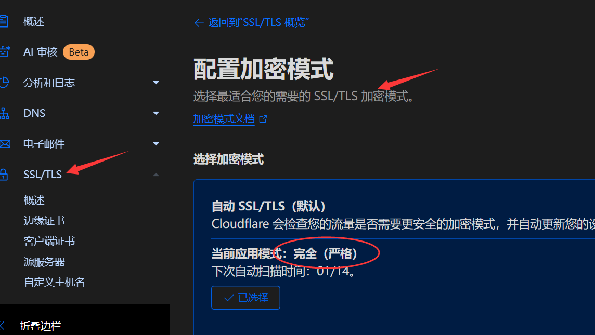

# vercel nodejs免费部署云函数

## 需求简介

有时候我们需要一些动态的api接口，例如网络验证，服务器根据用户请求的合法性动态返回相应的结果。订购服务器的价格略贵，仅仅需要几个api，显然大材小用了。

可以选择云函数(serverlsess functions)，腾讯、阿里以及百度的云函数都有各自的免费期限，超过期限就会开始收费，国内类似的平台还有memfire，不过前阵子（大概24年底）也开始收费了。

不想花钱的话，可以选择 [vercel](https://vercel.com/) 或 [cloudflare](https://dash.cloudflare.com/)，vercel 的免费计划持续免费，且额度非常大，小型项目完全够用。但由于vercel是国外网站，平台提供的域名无法在国内访问，但可以通过自定义域名，搭配 cloudflare 的 dns 解析来解决这个问题。

## 云函数部署步骤

vercel 支持很多语言和框架，我选择的是 nodejs，参考 [vercel官方云函数部署文档](https://vercel.com/docs/functions/quickstart)，便可以轻松的部署云函数，其过程大致如下（具体步骤可自行查阅相关资料）：

1. 创建一个 nodejs 项目，安装 vercel，编写云函数。

```js
// 初始化 npm 项目
npm init
// 安装 vercel
npm i vercel@latest

// 在项目根目录创建以下目录和文件
/api/hello/route.js
// 在 route.js 中写入以下代码
export function GET(request) {
    let respond = "Hello!";
  // ...
  // 经过一些自定义逻辑后返回相应的数据
  // ...
  return new Response(respond);
}
```

2. 将项目上传至 github 仓库，之后在vercel平台选择此仓库一键部署。
3. 部署成功后会得到一个 xxx.vercel.app 的域名，在国内无法访问。
4. 去腾讯云或阿里云买一个域名，价格在5到几百元不等（我选择五元的！）。
5. 在购买域名的平台上将域名的 DNS 服务商地址修改为 cloudflare 上提供的地址。
6. 之后回到 vercel 项目，在设置中自定义域名，添加上面购买的域名，添加时根据提示的 DNS记录，将DNS记录正确添加到 cloudflare。
7. 在 cloudflare 中将域名的 SSL 加密模式设置为完全严格，否则会出现重定向错误。

   
8. 完成以上步骤后等待几分钟即可通过自定义域名访问项目api，解决了国内无法访问的问题，至此，免费云函数搭建完毕。
