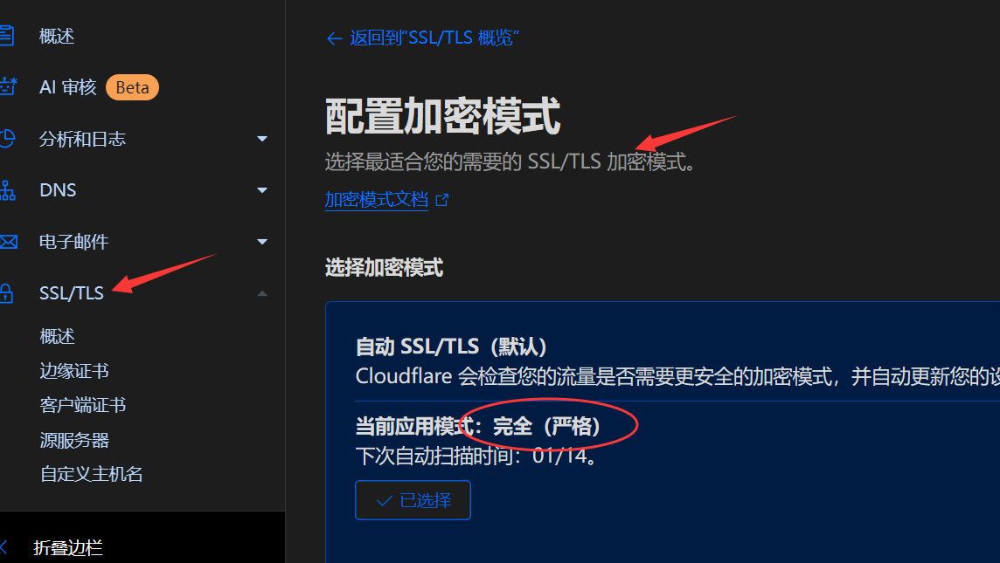

# docusaurus+github+vercel+cloudflare 免费部署博客

## 简介

本文记录了基于 [docusaurus](https://docusaurus.io/) 框架、[github](https://github.com/)、[vercel](https://vercel.com)、[cloudflare](https://dash.cloudflare.com/) 云平台免费搭建博客的过程。

docusaurus 的特点是简洁高效，非常适合用于文档的展示，并且可以通过修改配置项将其作为博客。用户较多，社区活跃，遇到问题便于解决。

## 搭建步骤

可参考[官方教程](https://docusaurus.io/zh-CN/docs)

### 创建项目

环境：win10，nodejs

```bash
# 初始化 npm
npm init

# 安装 docusaurus ，这里指定了网站名：my-website，主题：classic
npx create-docusaurus@latest my-website classic

# 执行以下命令，可以看到本地博客已经搭建完成了
npm run start
```

本地部署完之后，我们可以在 docs 和 blog 文件夹内添加文章，之后仍通过 npm run start 命令本地预览博客。

可通过官方文档了解更多 [ docusaurus 目录结构](https://docusaurus.io/docs/installation#project-structure)。

关于博客主题和布局的魔改，参考 [Docusaurus 主题魔改 | 愧怍](https://kuizuo.cn/docs/docusaurus-guides)

### 创建仓库

这一步没什么好说的，创建一个github仓库，将本地项目 push 上去就行了。

集成一键 push / pull 命令：

```js
// 通过修改 package.json 中的 scripts，集成一键 push / pull 命令
"scripts": {
    "push": "git add . && git commit -m '1' && git push -f origin main",
    "pull": "git stash && git pull -f origin main && git stash clear",
}, 
// 配置以上命令后(假设远程仓库名为origin和分支名为main)，便可以通过 npm run push 一键上传代码，通过npm run pull 一键拉取代码
```

### 部署vercel

登录 vercel 后，创建一个项目，选择刚刚的 github 仓库一键部署，vercel 会自动识别 docusaurus 框架，每次 push 更新 github 仓库后，vercel 都会自动执行 npm run build 来更新博客。部署成功后会得到一个类似于 xxx.vercel.app 的域名，通过代理访问该域名，可以正常访问博客，至此博客已经成功搭建完成。

但是，关闭代理后发现无法访问 vercel 提供的域名，这是因为国内防火墙策略屏蔽了 vercel.app，如果想要国内访问，需要自定义域名。

### 自定义域名

去腾讯云或阿里云买一个域名，下图为腾讯云域名价格，最便宜的5元。


在购买域名的平台上将域名的 DNS 服务商地址修改为 cloudflare 上提供的地址。


之后回到 vercel 项目，在设置中自定义域名，添加上面购买的域名，添加时根据提示的 DNS记录，将DNS记录正确添加到 cloudflare。

在 cloudflare 中将域名的 SSL 加密模式设置为完全严格，否则会出现重定向错误。



完成以上步骤后等待几分钟即可通过自定义域名访问项目api，解决了国内无法访问的问题，至此，免费云函数搭建完毕。

---

创建时间：2025年1月26日

更新时间：2025年1月27日
