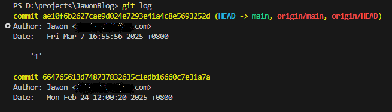
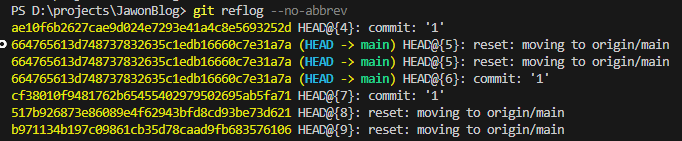

# GIt常见问题

### git pull 拉取冲突

拉取代码前有未提交的更改，提示冲突，拉取失败。

```bash
# 执行 git pull origin master 前有未提交的更改，出现报错
From https://gitee.com/... * branch master -> FETCH_HEAD 
...
Please commit your changes or stash them before you merge.

# 解决方法1：提交更改
git add .
git commit -m "message"

# 解决方法2：暂存未提交的更改，之后可以选择恢复或清除暂存区
git stash
# 恢复暂存的更改
git stash pop
# 清空暂存区
git stash clear

# 解决方法3：放弃未提交的更改
git reset --hard
```

### git clone 提示无法访问

运行环境：win10

网络状态：已开启 v2ray 代理，能正常访问google

问题：访问 github 失败，提示 fatal: unable to access...

解决方法：可以尝试配置或取消git的代理，根据所用代理工具的不同，ip和端口会有所差异。

```bash
# 配置 git 代理
git config http.proxy 127.0.0.1:10809
git config https.proxy 127.0.0.1:10809
# 或
git config --global http.proxy 127.0.0.1:10809
git config --global https.proxy 127.0.0.1:10809

# 取消 git 代理
git config --global --unset-all http.proxy
git config --global --unset-all https.proxy
# 或
git config --unset-all http.proxy
git config --unset-all https.proxy
```

### gitignore 没反应

问题：有时候想要让 git 忽略某个目录或文件，例如在 .gitignore 文件中添加 build/ ，但是添加后，build 目录仍然没有被忽略，这是因为该目录在添加到 .gitignore 之前就已经被 git 记录了。

解决方法：

```bash
# 删除 git 记录，但会保留本地文件
git rm -r --cached [path]
```

### git 版本回退

问题：新的提交存在bug，必须回退到之前的版本。

解决方法：

```bash
# 查看历史提交
git log
```

如下图，可以看到每次提交的时间和 commit 后面的一串id，复制目标id。



```bash
# 将当前分支重置到指定的提交
git reset --hard <目标提交的id>
```

重置之后再次使用 git log 查看历史提交，发现看不到最新的提交了，最新只显示到刚刚重置的地方，如果还想回到最新的提交怎么办？

```bash
# 查看历史操作记录
git reflog --no-abbrev
```

如下图，可以看到每次 HEAD 移动的 id，找到最新提交的id，再使用 git reset 命令就可以重置回去啦。



---

创建时间：2025年1月24日

更新时间：2025年2月15日
